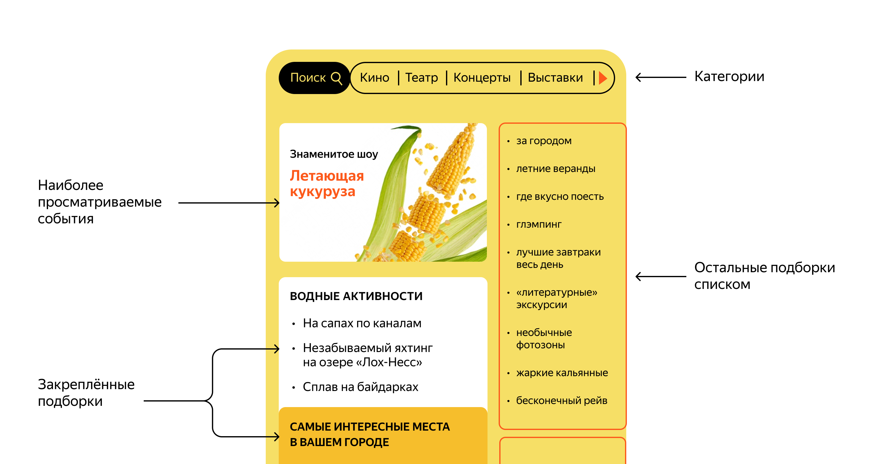

# Explore with me

### Стек:

- Java 11
- Spring Boot
- PostgreSQL
- Hibernate
- JPA
- Query DSL
- Maven
- Postman
- Docker
- Lombok
- Mapstruct

# Описание проекта

Explore with me - это REST-приложение для совместного планирования и посещения мероприятий. Пользователи могут создавать
мероприятия, доступные к посещению. После этого другие пользователи могут создавать заявки на участие в мероприятии, а
инициатор мероприятия подтверждает или отклоняет поданные заявки. Также в приложении доступно создание подборок событий.
Приложение разделено на два микросервиса - основной сервис и сервис статистики. Основной сервис отвечает за обработку
запросов пользователей и содержит все для работы приложения. Сервис статистики хранит количество просмотров событий и
позволяет делать различные выборки для анализа работы приложения. Работа приложения протестирована при помощи Postman
тестов.

## Swagger спецификации сервисов:

1. [Основной сервис](swagger/main-service-spec.json)
2. [Сервис статистики](swagger/stats-service-spec.json)

## Функционал приложения

### Пользователи

- создание пользователя
- поиск пользователей по ID
- удаление пользователя

### Категории событий

- создание категории
- обновление категории
- удаление категории
- получение категории по ID
- получение всех категорий

### События

- создание события
- обновление события
- поиск событий по опциональным критериям
- получение события по ID
- получение списка событий, созданных определенным пользователем

### Запросы на участие в событиях

- создание запроса на участие в событии
- отмена запроса на участие в событии
- получение списка запросов, созданных определенным пользователем
- получение списка запросов на участие в событиях, созданных определенным пользователем
- обновление статуса запросов на участие в событии

### Подборки событий

- создание подборки
- обновление подборки
- удаление подборки
- получение подборки по ID
- поиск подборок

### Статистика просмотра мероприятий

- статистика просмотров мероприятий по ID

### Дополнительная функциональность "Подписка на пользователей":

* пользователи могут разрешать и запрещать подписку на себя;
* пользователи могут подписываться на других пользователей;
* пользователи могут отменять подписку на других пользователей;
* пользователи могут получать список актуальных событий по подписке;
* администратор при поиске пользователей получает список их подписок;
* пользователь может получить информацию о себе со списком своих подписок.

## Тестирование приложения

Протестируйте приложение при помощи Postman тестов:

1. [Тесты основного сервиса](postman/main-service.json)
2. [Тесты сервиса статистики](postman/stat-service.json)
3. [Тесты дополнительной функциональности](postman/feature.json)

## Запуск приложения

1. Установите Docker на ваш компьютер: https://docs.docker.com/engine/install/
2. Запустите Docker
3. Клонируйте репозиторий: git clone https://github.com/Alex-Naumenko1986/java-explore-with-me.git
4. Войдите в проект и создайте jar файлы: mvn package
5. Запустите приложение: docker-compose up -d

## Схема базы данных основного сервиса

## Схема базы данных сервиса статистики

