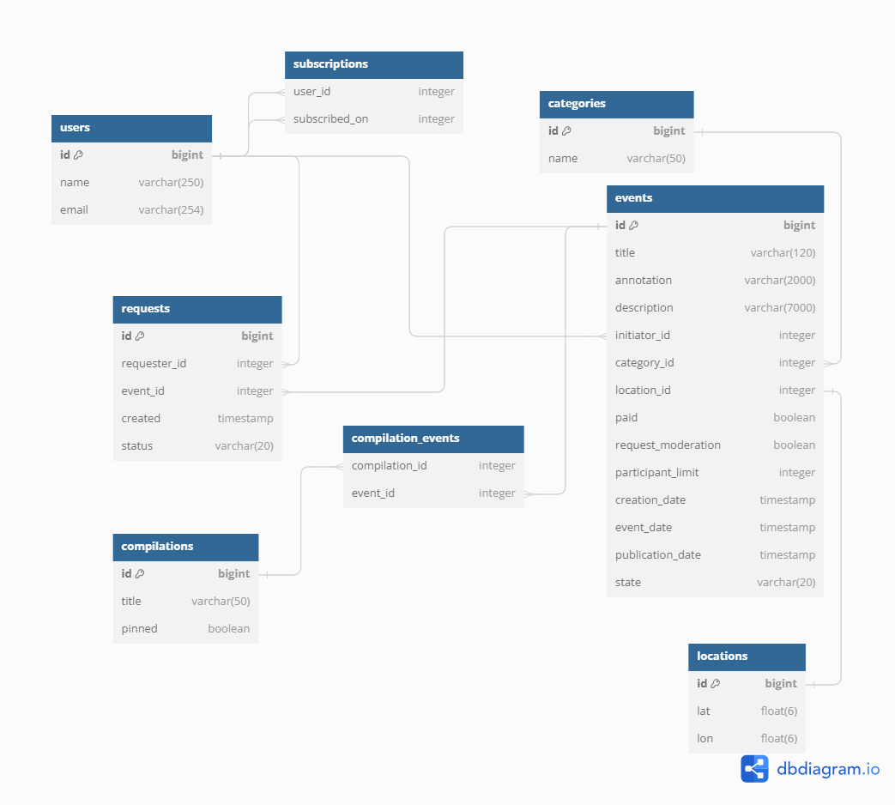

# java-explore-with-me

Template repository for ExploreWithMe project.

Pull request третьего этапа: https://github.com/Alex-Naumenko1986/java-explore-with-me/pull/3

Дополнительная функциональность "Подписка на пользователей":

* пользователи могут разрешать и запрещать подписку на себя;
* пользователи могут подписываться на других пользователей;
* пользователи могут отменять подписку на других пользователей;
* пользователи могут получать список актуальных событий по подписке;
* администратор при поиске пользователей получает список их подписок;
* пользователь может получить информацию о себе со списком своих подписок.

## Main service database scheme

## Stats service database scheme

